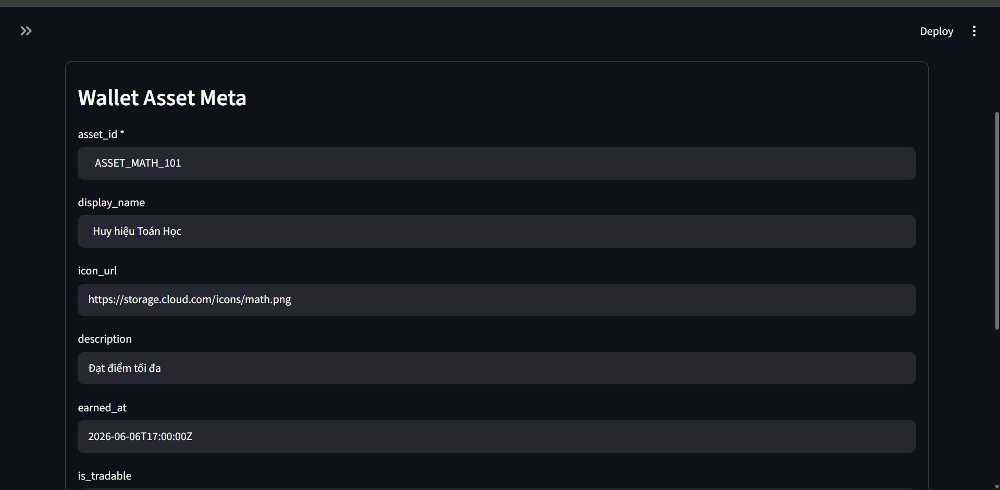
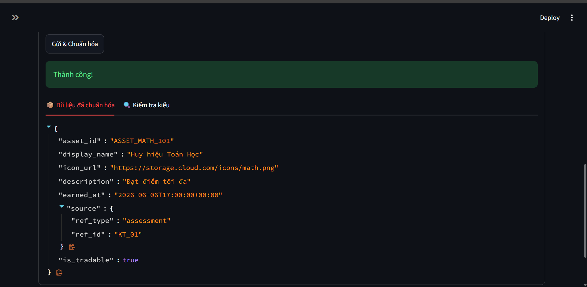
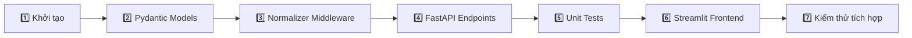

<div align="center">

# 🚀 ETechs Data Normalizer


Hệ thống chuẩn hóa dữ liệu đầu vào cho các collection **MongoDB** — validate, làm sạch (trim whitespace, chuẩn hóa kiểu dữ liệu, kiểm tra enum, ràng buộc logic) trước khi lưu vào database.

</div>

---

## ✨ Tính năng

| Tính năng | Mô tả |
|-----------|-------|
| 📦 | Chuẩn hóa dữ liệu collection `wallet_meta` |
| 📦 | Chuẩn hóa dữ liệu collection `wallet_asset_meta` |
| 📦 | Chuẩn hóa dữ liệu collection `wallet_transaction_meta` |
| 📦 | Chuẩn hóa dữ liệu collection `identity_meta` |
| 📦 | Chuẩn hóa dữ liệu collection `education_meta` (Mới) |
| ✂️ | Tự động trim khoảng trắng, chuẩn hóa chữ hoa/thường |
| 📅 | Parse datetime từ chuỗi ISO format |
| 🔄 | Ép kiểu Boolean từ string |
| 🔢 | Ép kiểu số từ string → int |
| 🔍 | Kiểm tra enum (`triggered_by`) |
| 🛡️ | Ràng buộc logic nghiệp vụ (số dư không âm) |
| ❗ | Kiểm tra trường bắt buộc |
| 🌐 | API RESTful với tài liệu tự động (Swagger UI) |
| 🖥️ | Giao diện Streamlit nhập liệu trực quan |

---

## 🛠️ Công nghệ sử dụng

| Thành phần | Công nghệ |
|------------|-----------|
| ⚙️ Backend |    |
| ✅ Validation |  |
| 🎨 Frontend |  |
| 🧪 Testing |  |
| 🔧 Khác |   |

---

## Demo quá trình chuẩn hóa 




---

## 📁 Cấu trúc thư mục

```
etechs/
├── backend/
│   ├── main.py                          # 📡 FastAPI app - định nghĩa endpoints
│   ├── database.py                      # 🔌 Kết nối cơ sở dữ liệu MongoDB
│   ├── requirements.txt                 # 📦 Danh sách dependencies
│   ├── middleware/
│   │   ├── __init__.py
│   │   ├── normalizer.py                # 🔄 Hàm điều phối normalize_data()
│   │   ├── models/
│   │   │   ├── __init__.py
│   │   │   ├── wallet_meta.py           # 🧾 Pydantic model cho wallet_meta
│   │   │   ├── wallet_asset_meta.py     # 🧾 Pydantic model cho wallet_asset_meta
│   │   │   ├── wallet_transaction_meta.py # 🧾 Pydantic model cho wallet_transaction_meta
│   │   │   ├── identity_meta.py         # 🧾 Pydantic model cho identity_meta
│   │   │   └── education_meta.py        # 🧾 Pydantic model cho education_meta
│   │   └── repositories/
│   │       ├── __init__.py
│   │       └── wallet_repo.py           # 🗄️ Repositories lưu MongoDB
│   └── tests/
│       ├── __init__.py
│       └── test_normalizer.py           # 🧪 Unit tests
├── frontend/
│   └── form.py                          # 🖥️ Streamlit UI
├── docs/                                # 📚 Tài liệu dự án (Word, PDF)
└── README.md
```

---

## 🚀 Hướng dẫn cài đặt & chạy

### 📋 Yêu cầu

| Công cụ | Phiên bản |
|---------|-----------|
|  | 3.12+ |
|  | (đi kèm Python) |

### 1️⃣ Clone dự án

```bash
git clone git@github.com:phantrongnguyen/etechs-database-frontend.git
cd etechs
```

### 2️⃣ Tạo môi trường ảo & cài dependencies

```bash
cd backend
python -m venv venv
venv\Scripts\activate
pip install -r requirements.txt
```

### 3️⃣ Chạy backend (FastAPI)

```bash
.\venv\Scripts\uvicorn.exe main:app --reload
```

| Trang | URL |
|------|-----|
| 🌐 Backend | **http://localhost:8000** |
| 📖 Swagger UI | **http://localhost:8000/docs** |

### 4️⃣ Chạy frontend (Streamlit) — mở terminal riêng

```bash
cd backend
.\venv\Scripts\streamlit.exe run ..\frontend\form.py
```

| Trang | URL |
|------|-----|
| 🖥️ Frontend | **http://localhost:8501** |

---

## 🌐 API Endpoints

### `GET /health`

🩺 Kiểm tra trạng thái server.

**Response:**
```json
{ "status": "ok" }
```

### `POST /normalize`

📤 Chuẩn hóa dữ liệu theo tên collection.

**Request body:**
```json
{
  "collection_name": "wallet_asset_meta",
  "raw_data": {
    "asset_id": "   ASSET_001   ",
    "display_name": "  Huy hiệu  ",
    "icon_url": "https://example.com/icon.png",
    "earned_at": "2026-06-06T17:00:00Z",
    "source": { "ref_type": "   assessment   ", "ref_id": "ID_01" },
    "is_tradable": "True"
  }
}
```

**Response (200):**
```json
{
  "asset_id": "ASSET_001",
  "display_name": "Huy hiệu",
  "icon_url": "https://example.com/icon.png",
  "earned_at": "2026-06-06T17:00:00+00:00",
  "source": { "ref_type": "assessment", "ref_id": "ID_01" },
  "is_tradable": true
}
```

### `POST /normalize/wallet_asset_meta`

📦 Endpoint riêng cho collection `wallet_asset_meta` (không cần truyền `collection_name`).

### `POST /normalize/wallet_transaction_meta`

📦 Endpoint riêng cho collection `wallet_transaction_meta`.

### `POST /normalize/wallet_meta`

📦 Endpoint riêng cho collection `wallet_meta`.

### `POST /normalize/identity_meta`

📦 Endpoint riêng cho collection `identity_meta`.

### `POST /normalize/education_meta`

📦 Endpoint riêng cho collection `education_meta`.

---

## 🧪 Chạy kiểm thử

```bash
cd backend
pytest tests\test_normalizer.py -v
```

Kết quả mong đợi: **✅ 14 passed**

| Test case | Mục đích |
|-----------|----------|
| `test_wallet_meta_valid` | ✅ Chuẩn hóa và làm sạch thông tin ví |
| `test_wallet_asset_meta_valid` | ✅ Dữ liệu tài sản hợp lệ → trim string, parse datetime, ép boolean |
| `test_wallet_asset_meta_missing_required` | ❌ Thiếu trường bắt buộc → trả về None |
| `test_wallet_transaction_meta_valid` | ✅ Ép kiểu số từ string, lowercasing |
| `test_wallet_transaction_meta_invalid_enum` | ❌ triggered_by không hợp lệ → trả về None |
| `test_wallet_transaction_meta_negative_balance` | ❌ Số dư âm → trả về None |
| `test_identity_meta_valid` | ✅ Dữ liệu căn cước hợp lệ, trim chuỗi, gán giá trị mặc định |
| `test_identity_meta_defaults` | ✅ Trả về giá trị mặc định khi thiếu trường tùy chọn |
| `test_identity_meta_invalid_status` | ❌ Trạng thái xác minh không hợp lệ → trả về None |
| `test_identity_meta_missing_required` | ❌ Thiếu trường bắt buộc indentity_id → trả về None |
| `test_education_meta_valid` | ✅ Dữ liệu học vấn hợp lệ, trim chuỗi, làm sạch mảng |
| `test_education_meta_defaults` | ✅ Trả về giá trị mặc định của bảng học vấn |
| `test_education_meta_invalid_enum` | ❌ Trạng thái xác minh học vấn sai enum → trả về None |
| `test_education_meta_missing_required` | ❌ Thiếu trường bắt buộc education_id → trả về None |

---

## 📋 Quy trình phát triển



### Bước 1: Khởi tạo dự án
- 🏗️ Tạo cấu trúc thư mục backend/frontend
- ⚙️ Thiết lập môi trường ảo Python
- 📥 Cài đặt FastAPI, Uvicorn, Pydantic, Streamlit

### Bước 2: Xây dựng Pydantic Models
- 🧩 Tách riêng model cho từng collection MongoDB
- ✏️ Sử dụng `field_validator` để trim string, parse datetime, kiểm tra enum
- 🪆 Xây dựng model con (nested) như `AssetSource`, `BalanceSnapshot`

### Bước 3: Xây dựng Normalizer Middleware
- 🔗 Tạo hàm `normalize_data()` nhận collection_name + raw_data
- 🎯 Điều phối đến model tương ứng
- ⚠️ Xử lý lỗi tập trung

### Bước 4: Xây dựng FastAPI Endpoints
- 🩺 `GET /health` — kiểm tra health check
- 📤 `POST /normalize` — endpoint tổng quát
- 📦 `POST /normalize/wallet_asset_meta` — endpoint riêng
- 📦 `POST /normalize/wallet_transaction_meta` — endpoint riêng

### Bước 5: Viết Unit Tests
- ✅ Test happy path: dữ liệu hợp lệ → chuẩn hóa thành công
- 🧪 Test edge cases: thiếu field, enum sai, số âm
- 🔁 Dùng Pytest để kiểm thử tự động

### Bước 6: Xây dựng Frontend Streamlit
- 🖊️ Form nhập liệu cho từng collection
- 📡 Gọi API backend bằng requests
- 📄 Hiển thị kết quả JSON

### Bước 7: Kiểm thử tích hợp
- 🔄 Chạy backend + frontend đồng thời
- 📈 Kiểm tra luồng dữ liệu từ UI → API → Model → Response

---

## 🧰 Mở rộng

Để thêm collection mới:

| Bước | Hành động |
|------|-----------|
| 1️⃣ | Tạo file model mới trong `backend/middleware/models/` (VD: `student_profile.py`) |
| 2️⃣ | Viết Pydantic BaseModel với các `field_validator` tương ứng |
| 3️⃣ | Thêm `elif` trong `normalizer.py` để mapping collection_name → model |
| 4️⃣ | Thêm endpoint mới trong `main.py` nếu cần |
| 5️⃣ | Viết test cases trong `tests/` |
| 6️⃣ | Thêm form nhập liệu trong `frontend/form.py` |

---

## 📄 License

Distributed under the **MIT License**. See `LICENSE` for more information.
